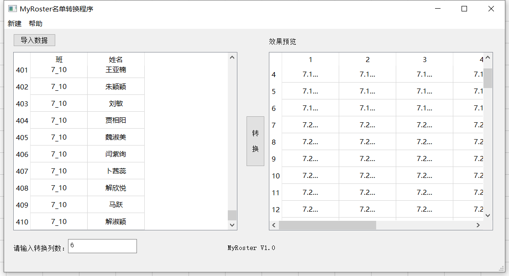

# MyRoster
花名册快速转换工具

## 导出为exe

安装PyInstaller：
`pip3 install PyInstaller`

指定icon并生成exe:
`pyinstaller -w --icon=icon.ico roster.py -F -p c:\python38\lib\site-packages --hidden-import openpyxl --hidden-import jinja2`

## 效果图
